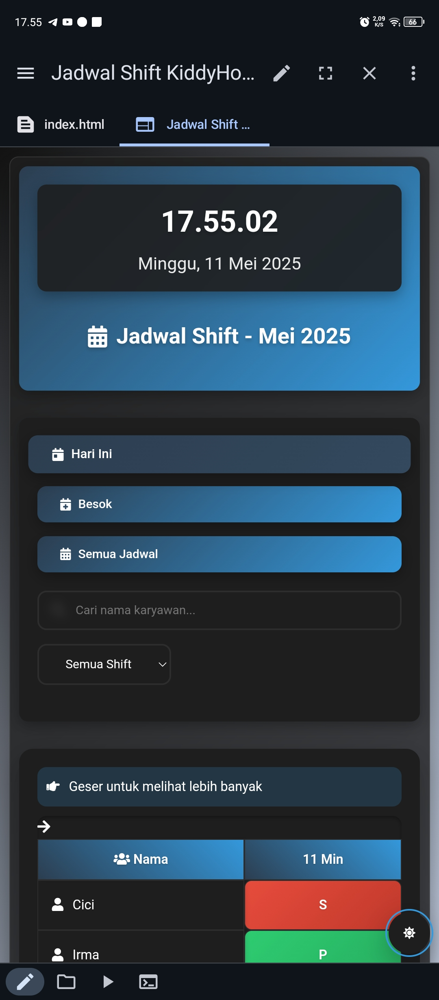

# 📅 Aplikasi Jadwal Shift Karyawan


<p align="center">
  
</p>

## 📌 Daftar Isi
- [Fitur Utama](#-fitur-utama)
- [Demo](#-demo)
- [Teknologi](#-teknologi)
- [Instalasi](#-instalasi)
- [Penggunaan](#-penggunaan)
- [Struktur Project](#-struktur-project)
- [Kustomisasi](#-kustomisasi)
- [Kontribusi](#-kontribusi)
- [Lisensi](#-lisensi)
- [Kontak](#-kontak)

## ✨ Fitur Utama

### Manajemen Jadwal
- 📊 Tampilan jadwal harian, besok, dan bulanan
- 🔍 Pencarian karyawan real-time
- 📋 Filter berdasarkan jenis shift
- 📈 Ringkasan statistik shift

### Antarmuka Pengguna
- 🌓 Mode gelap/terang
- 📱 Responsif di semua perangkat
- 💫 Animasi smooth
- 🎯 Navigasi intuitif

### Fungsionalitas
- 📤 Export ke Excel
- 🖨️ Print-friendly version
- 📲 PWA support (offline capable)
- 📱 Share ke berbagai platform

### Fitur Tambahan
- ⚡ Performa optimal
- 🔒 Data persistensi lokal
- 🌐 Cross-browser compatibility
- ♿ Aksesibilitas penuh

## 🔥 Demo

Lihat demo aplikasi [di sini](https://bidzz-rawr.github.io/Jadwal-KiddyHope)

## 🛠 Teknologi

- HTML5
- CSS3 (Flexbox & Grid)
- Vanilla JavaScript (ES6+)
- PWA (Service Workers)
- Local Storage
- Font Awesome Icons

## 📥 Instalasi

1. Clone repository:
```bash
git clone https://github.com/BIDZZ-RAWR/Jadwal-KiddyHope.git
```

2. Masuk ke direktori:
```bash
cd Jadwal-KiddyHope
```

3. Buka dengan live server atau server lokal Anda.

## 💻 Penggunaan

## 🎨 Kustomisasi

### Menambah Jenis Shift
1. Tambahkan di data shift
2. Update CSS untuk styling
3. Sesuaikan ringkasan statistik

### Mengubah Tampilan
1. Modifikasi variabel CSS
2. Sesuaikan tema gelap/terang
3. Kustomisasi animasi

## 🤝 Kontribusi

Kontribusi selalu diterima dengan senang hati! Langkah-langkah:

1. Fork repository
2. Buat branch fitur (`git checkout -b feature/AmazingFeature`)
3. Commit perubahan (`git commit -m 'Add some AmazingFeature'`)
4. Push ke branch (`git push origin feature/AmazingFeature`)
5. Buka Pull Request

## 📝 Lisensi

Didistribusikan di bawah Lisensi MIT. Lihat `LICENSE` untuk informasi lebih lanjut :

## 🙏 Terimakasih

* Allah SWT
* Orang Tua
* [Font Awesome](https://fontawesome.com)
* [Google Fonts](https://fonts.google.com)
* [Shields.io](https://shields.io)

## 📈 Roadmap

- [x] Implementasi dasar
- [x] Mode gelap/terang
- [x] PWA Support
- [ ] Multiple bahasa
- [ ] Dashboard admin
- [ ] Notifikasi real-time
- [ ] Integrasi database
- [x] Mobile app version

## 📊 Statistik Project


---

<p align="center">
  Made with ❤️ by <a href="https://github.com/BIDZZ-RAWR">Muhammad Abid</a>
</p>